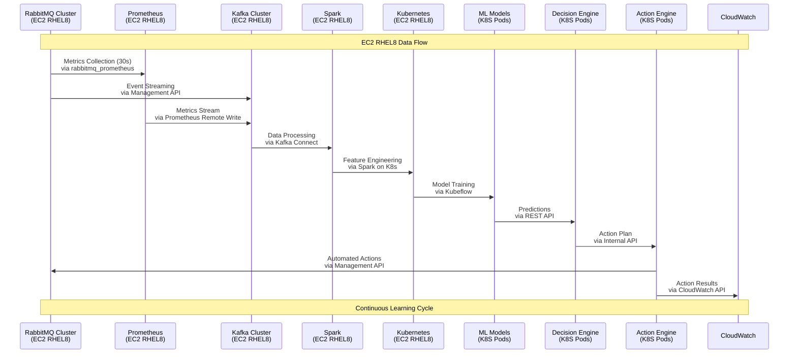
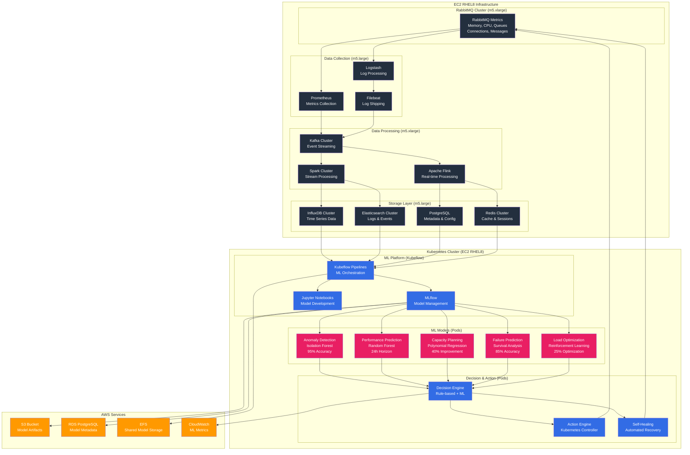

# RabbitMQ AI/ML Operations - EC2 RHEL8 Architecture

## 🏗️ **EC2 RHEL8 Infrastructure Architecture**

```mermaid
graph TB
    subgraph "AWS Cloud Infrastructure"
        subgraph "VPC (10.0.0.0/16)"
            subgraph "Public Subnet (10.0.1.0/24)"
                IGW[Internet Gateway]
                NAT[NAT Gateway]
                ALB[Application Load Balancer]
                BASTION[Bastion Host<br/>t3.medium<br/>RHEL8]
            end
            
            subgraph "Private Subnet A (10.0.2.0/24)"
                subgraph "RabbitMQ Cluster"
                    RMQ1[RabbitMQ Node 1<br/>m5.xlarge<br/>RHEL8<br/>10.0.2.10]
                    RMQ2[RabbitMQ Node 2<br/>m5.xlarge<br/>RHEL8<br/>10.0.2.11]
                    RMQ3[RabbitMQ Node 3<br/>m5.xlarge<br/>RHEL8<br/>10.0.2.12]
                end
                
                subgraph "Monitoring Stack"
                    PROM[Prometheus Server<br/>m5.large<br/>RHEL8<br/>10.0.2.20]
                    GRAFANA[Grafana Server<br/>m5.large<br/>RHEL8<br/>10.0.2.21]
                    INFLUX[InfluxDB<br/>m5.large<br/>RHEL8<br/>10.0.2.22]
                end
            end
            
            subgraph "Private Subnet B (10.0.3.0/24)"
                subgraph "AI/ML Platform"
                    KUBE1[Kubernetes Master<br/>m5.xlarge<br/>RHEL8<br/>10.0.3.10]
                    KUBE2[Kubernetes Worker 1<br/>m5.xlarge<br/>RHEL8<br/>10.0.3.11]
                    KUBE3[Kubernetes Worker 2<br/>m5.xlarge<br/>RHEL8<br/>10.0.3.12]
                end
                
                subgraph "Data Pipeline"
                    KAFKA1[Kafka Node 1<br/>m5.large<br/>RHEL8<br/>10.0.3.20]
                    KAFKA2[Kafka Node 2<br/>m5.large<br/>RHEL8<br/>10.0.3.21]
                    KAFKA3[Kafka Node 3<br/>m5.large<br/>RHEL8<br/>10.0.3.22]
                    SPARK[Spark Master<br/>m5.xlarge<br/>RHEL8<br/>10.0.3.30]
                end
            end
            
            subgraph "Private Subnet C (10.0.4.0/24)"
                subgraph "Storage Layer"
                    ES1[Elasticsearch Node 1<br/>m5.large<br/>RHEL8<br/>10.0.4.10]
                    ES2[Elasticsearch Node 2<br/>m5.large<br/>RHEL8<br/>10.0.4.11]
                    ES3[Elasticsearch Node 3<br/>m5.large<br/>RHEL8<br/>10.0.4.12]
                    POSTGRES[PostgreSQL<br/>m5.large<br/>RHEL8<br/>10.0.4.20]
                    REDIS[Redis Cluster<br/>m5.medium<br/>RHEL8<br/>10.0.4.30]
                end
            end
        end
        
        subgraph "AWS Services"
            S3[S3 Bucket<br/>rabbitmq-aiml-data]
            RDS[RDS PostgreSQL<br/>Multi-AZ]
            EFS[EFS File System<br/>Shared Storage]
            CLOUDWATCH[CloudWatch<br/>Logs & Metrics]
            SNS[SNS<br/>Notifications]
        end
    end
    
    subgraph "External Access"
        ADMIN[Administrators]
        USERS[End Users]
        API[API Clients]
    end
    
    %% Network Connections
    ADMIN --> IGW
    USERS --> ALB
    API --> ALB
    
    IGW --> ALB
    ALB --> RMQ1
    ALB --> RMQ2
    ALB --> RMQ3
    
    BASTION --> RMQ1
    BASTION --> RMQ2
    BASTION --> RMQ3
    BASTION --> PROM
    BASTION --> GRAFANA
    
    RMQ1 --> PROM
    RMQ2 --> PROM
    RMQ3 --> PROM
    
    PROM --> GRAFANA
    PROM --> INFLUX
    
    RMQ1 --> KAFKA1
    RMQ2 --> KAFKA2
    RMQ3 --> KAFKA3
    
    KAFKA1 --> SPARK
    KAFKA2 --> SPARK
    KAFKA3 --> SPARK
    
    SPARK --> ES1
    SPARK --> ES2
    SPARK --> ES3
    
    KUBE1 --> ES1
    KUBE1 --> POSTGRES
    KUBE1 --> REDIS
    
    PROM --> CLOUDWATCH
    GRAFANA --> CLOUDWATCH
    
    %% Styling
    classDef aws fill:#ff9900,color:#fff
    classDef ec2 fill:#232f3e,color:#fff
    classDef rhel8 fill:#ee0000,color:#fff
    classDef network fill:#146eb4,color:#fff
    classDef storage fill:#3f48cc,color:#fff
    classDef external fill:#999,color:#fff
    
    class IGW,NAT,ALB,BASTION,S3,RDS,EFS,CLOUDWATCH,SNS aws
    class RMQ1,RMQ2,RMQ3,PROM,GRAFANA,INFLUX,KUBE1,KUBE2,KUBE3,KAFKA1,KAFKA2,KAFKA3,SPARK,ES1,ES2,ES3,POSTGRES,REDIS ec2
    class RMQ1,RMQ2,RMQ3,PROM,GRAFANA,INFLUX,KUBE1,KUBE2,KUBE3,KAFKA1,KAFKA2,KAFKA3,SPARK,ES1,ES2,ES3,POSTGRES,REDIS rhel8
    class VPC,Public,Private,Subnet network
    class S3,RDS,EFS storage
    class ADMIN,USERS,API external
```



## 🔄 **Data Flow Architecture - EC2 RHEL8**



## 🧠 **AI/ML Model Architecture - EC2 RHEL8**



## 🎯 **EC2 Instance Specifications**

### **RabbitMQ Cluster (3 nodes)**
```yaml
Instance Type: m5.xlarge
OS: RHEL 8.7
vCPUs: 4
Memory: 16 GB
Storage: 100 GB GP3 EBS
Network: Enhanced Networking
Placement: Multi-AZ
```

### **Monitoring Stack (3 nodes)**
```yaml
Instance Type: m5.large
OS: RHEL 8.7
vCPUs: 2
Memory: 8 GB
Storage: 50 GB GP3 EBS
Network: Enhanced Networking
Placement: Multi-AZ
```

### **Kubernetes Cluster (3 nodes)**
```yaml
Instance Type: m5.xlarge
OS: RHEL 8.7
vCPUs: 4
Memory: 16 GB
Storage: 100 GB GP3 EBS
Network: Enhanced Networking
Placement: Multi-AZ
```

### **Data Pipeline (4 nodes)**
```yaml
Instance Type: m5.large
OS: RHEL 8.7
vCPUs: 2
Memory: 8 GB
Storage: 50 GB GP3 EBS
Network: Enhanced Networking
Placement: Multi-AZ
```

### **Storage Layer (5 nodes)**
```yaml
Instance Type: m5.large
OS: RHEL 8.7
vCPUs: 2
Memory: 8 GB
Storage: 100 GB GP3 EBS
Network: Enhanced Networking
Placement: Multi-AZ
```

## 🔧 **Network Configuration**

### **VPC Configuration**
```yaml
VPC CIDR: 10.0.0.0/16
Public Subnet: 10.0.1.0/24
Private Subnet A: 10.0.2.0/24 (RabbitMQ & Monitoring)
Private Subnet B: 10.0.3.0/24 (Kubernetes & Data Pipeline)
Private Subnet C: 10.0.4.0/24 (Storage Layer)
```

### **Security Groups**
```yaml
RabbitMQ Security Group:
  - Inbound: 5672 (AMQP), 15672 (Management), 25672 (Clustering)
  - Inbound: 4369 (EPMD), 35672-35682 (Clustering Ports)
  - Inbound: 15692 (Prometheus Metrics)

Monitoring Security Group:
  - Inbound: 9090 (Prometheus), 3000 (Grafana), 8086 (InfluxDB)
  - Inbound: 9200 (Elasticsearch), 5432 (PostgreSQL), 6379 (Redis)

Kubernetes Security Group:
  - Inbound: 6443 (API Server), 2379-2380 (etcd), 10250 (kubelet)
  - Inbound: 10251 (kube-scheduler), 10252 (kube-controller-manager)

Data Pipeline Security Group:
  - Inbound: 9092 (Kafka), 8080 (Spark), 8081 (Flink)
  - Inbound: 2181 (Zookeeper)
```

## 📊 **Storage Configuration**

### **EBS Volumes**
```yaml
RabbitMQ Nodes:
  - Root Volume: 20 GB GP3
  - Data Volume: 100 GB GP3 (IOPS: 3000, Throughput: 125 MB/s)

Monitoring Nodes:
  - Root Volume: 20 GB GP3
  - Data Volume: 50 GB GP3 (IOPS: 3000, Throughput: 125 MB/s)

Kubernetes Nodes:
  - Root Volume: 20 GB GP3
  - Data Volume: 100 GB GP3 (IOPS: 3000, Throughput: 125 MB/s)

Storage Nodes:
  - Root Volume: 20 GB GP3
  - Data Volume: 100 GB GP3 (IOPS: 3000, Throughput: 125 MB/s)
```

### **EFS Configuration**
```yaml
EFS File System:
  - Performance Mode: General Purpose
  - Throughput Mode: Provisioned (100 MB/s)
  - Encryption: Enabled
  - Access Points: /ml-models, /shared-data, /backups
```

## 🚀 **High Availability Configuration**

### **Multi-AZ Deployment**
```yaml
Availability Zones:
  - AZ-1: us-east-1a (Primary)
  - AZ-2: us-east-1b (Secondary)
  - AZ-3: us-east-1c (Tertiary)

RabbitMQ Cluster:
  - Node 1: us-east-1a
  - Node 2: us-east-1b
  - Node 3: us-east-1c

Kubernetes Cluster:
  - Master: us-east-1a
  - Worker 1: us-east-1b
  - Worker 2: us-east-1c
```

### **Load Balancing**
```yaml
Application Load Balancer:
  - Type: Application Load Balancer
  - Scheme: Internet-facing
  - Subnets: Public Subnet (Multi-AZ)
  - Target Groups: RabbitMQ Management, Grafana, Prometheus
  - Health Checks: HTTP/HTTPS
  - SSL/TLS: ACM Certificate
```

## 🔒 **Security Configuration**

### **IAM Roles**
```yaml
RabbitMQ Instance Role:
  - CloudWatchLogsFullAccess
  - EC2InstanceProfileForImageBuilder
  - SSMManagedInstanceCore

Kubernetes Instance Role:
  - EKSWorkerNodePolicy
  - EKS_CNI_Policy
  - EC2ContainerRegistryReadOnly

Monitoring Instance Role:
  - CloudWatchFullAccess
  - S3FullAccess
  - RDSFullAccess
```

### **Encryption**
```yaml
Data at Rest:
  - EBS Volumes: AES-256 encryption
  - EFS: AES-256 encryption
  - RDS: AES-256 encryption
  - S3: AES-256 encryption

Data in Transit:
  - RabbitMQ: TLS 1.2+
  - Kubernetes: TLS 1.2+
  - Monitoring: TLS 1.2+
  - Data Pipeline: TLS 1.2+
```

This architecture provides a robust, scalable, and secure foundation for your RabbitMQ AI/ML operations system on EC2 RHEL8 infrastructure.
