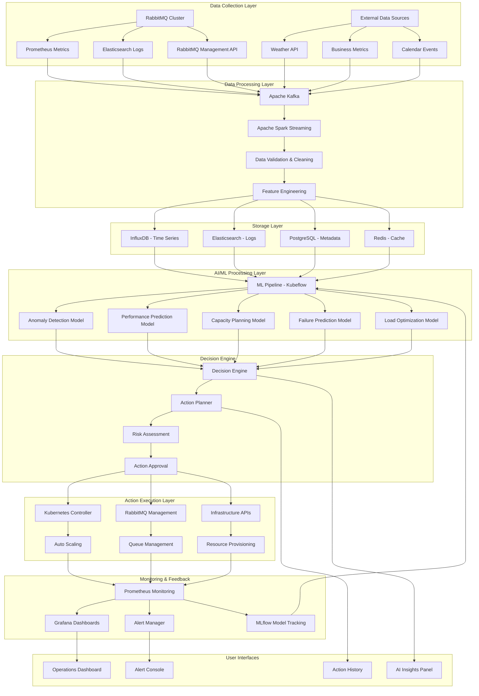
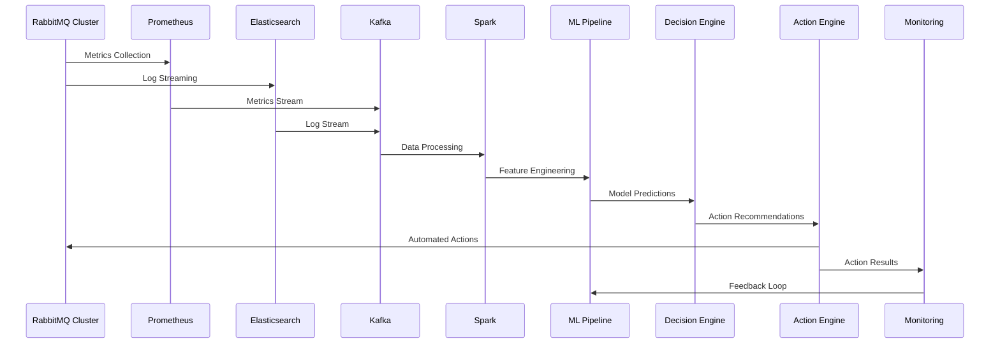
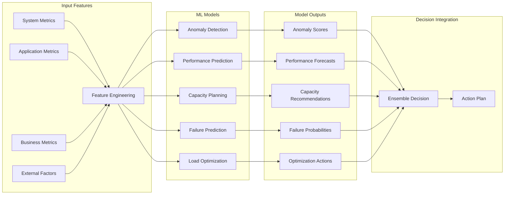

# RabbitMQ AI/ML Operations Architecture

## 🏗️ System Architecture Diagram

## 🔄 Data Flow Architecture

## 🧠 AI/ML Model Architecture

## 🎯 Component Details

### **Data Collection Layer**
- **RabbitMQ Cluster**: Primary data source
- **Prometheus**: Metrics collection and storage
- **Elasticsearch**: Log aggregation and search
- **External APIs**: Weather, business, calendar data

### **Data Processing Layer**
- **Apache Kafka**: Real-time data streaming
- **Apache Spark**: Stream processing and batch analytics
- **Data Validation**: Quality assurance and cleaning
- **Feature Engineering**: ML feature preparation

### **Storage Layer**
- **InfluxDB**: Time-series metrics storage
- **Elasticsearch**: Log and event storage
- **PostgreSQL**: Metadata and configuration
- **Redis**: High-speed caching layer

### **AI/ML Processing Layer**
- **Kubeflow**: ML pipeline orchestration
- **MLflow**: Model lifecycle management
- **TensorFlow/PyTorch**: Deep learning models
- **Scikit-learn**: Traditional ML algorithms

### **Decision Engine**
- **Rule Engine**: Business logic and policies
- **Risk Assessment**: Action impact evaluation
- **Approval Workflow**: Human oversight integration
- **Action Planning**: Optimal action sequencing

### **Action Execution Layer**
- **Kubernetes**: Container orchestration
- **RabbitMQ Management**: Queue and cluster management
- **Infrastructure APIs**: Cloud resource management
- **Automation Scripts**: Custom action implementations

### **Monitoring & Feedback**
- **Prometheus**: Metrics collection
- **Grafana**: Visualization and dashboards
- **Alert Manager**: Intelligent alerting
- **MLflow**: Model performance tracking

## 🔧 Technology Stack

### **Core Technologies**
- **Container Platform**: Kubernetes 1.28+
- **ML Platform**: Kubeflow 1.8+
- **Data Pipeline**: Apache Kafka 3.5+, Apache Spark 3.4+
- **Storage**: InfluxDB 2.7+, Elasticsearch 8.10+
- **Monitoring**: Prometheus 2.45+, Grafana 10.2+

### **AI/ML Libraries**
- **Deep Learning**: TensorFlow 2.13+, PyTorch 2.1+
- **Traditional ML**: Scikit-learn 1.3+, XGBoost 1.7+
- **Time Series**: Prophet, ARIMA, LSTM
- **Anomaly Detection**: Isolation Forest, One-Class SVM
- **Reinforcement Learning**: OpenAI Gym, Stable Baselines3

### **Development Tools**
- **Model Management**: MLflow 2.7+
- **Data Validation**: Great Expectations
- **Feature Store**: Feast
- **Model Serving**: Seldon Core, KServe
- **CI/CD**: ArgoCD, Tekton

This architecture provides a comprehensive foundation for AI-driven RabbitMQ operations with scalable, maintainable, and intelligent automation capabilities.
