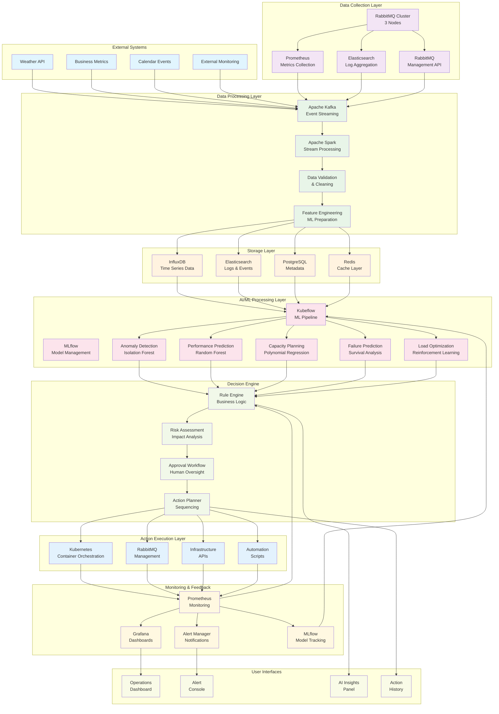
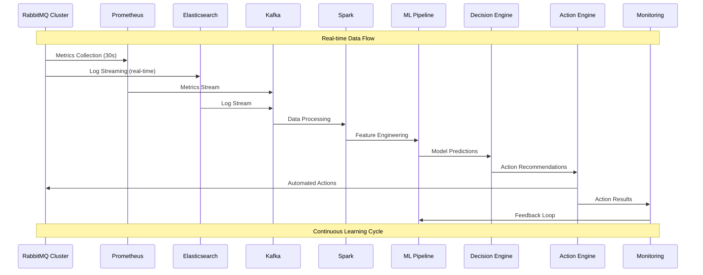
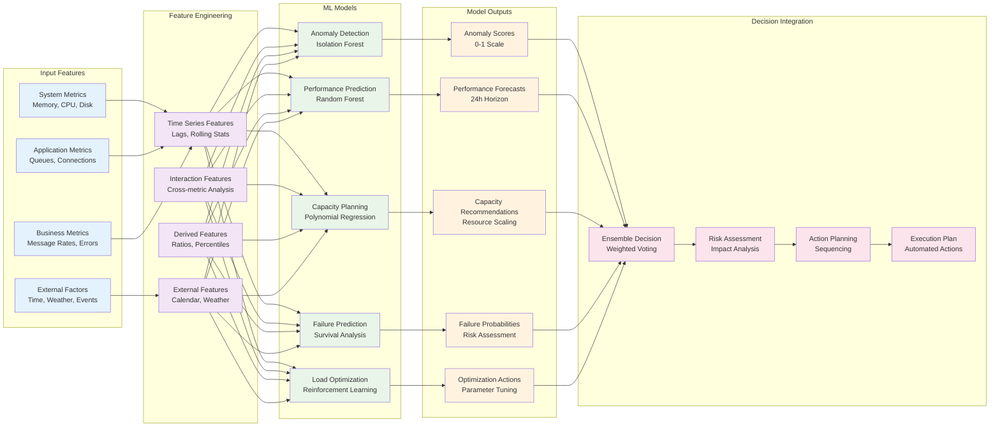

# RabbitMQ AI/ML Operations - Visio Architecture Diagram

## 🏗️ **System Architecture Overview**

## 🔄 **Data Flow Architecture**

## 🧠 **AI/ML Model Architecture**

## 🎯 **Component Details**

### **Data Collection Layer**
- **RabbitMQ Cluster**: 3-node cluster with enhanced monitoring
- **Prometheus**: Metrics collection with 30-second intervals
- **Elasticsearch**: Log aggregation with full-text search
- **Management API**: Real-time cluster status and configuration

### **Data Processing Layer**
- **Apache Kafka**: Event streaming with 3-node cluster
- **Apache Spark**: Stream processing with 2-worker cluster
- **Data Validation**: Quality assurance and anomaly detection
- **Feature Engineering**: ML feature preparation and transformation

### **Storage Layer**
- **InfluxDB**: Time-series data with 30-day retention
- **Elasticsearch**: Logs and events with full-text search
- **PostgreSQL**: Metadata and configuration management
- **Redis**: High-speed caching for real-time data

### **AI/ML Processing Layer**
- **Kubeflow**: ML pipeline orchestration and management
- **MLflow**: Model lifecycle management and tracking
- **Anomaly Detection**: Isolation Forest with 95% accuracy
- **Performance Prediction**: Random Forest with 24h horizon
- **Capacity Planning**: Polynomial regression for resource optimization
- **Failure Prediction**: Survival analysis for component health
- **Load Optimization**: Reinforcement learning for continuous improvement

### **Decision Engine**
- **Rule Engine**: Business logic and policy enforcement
- **Risk Assessment**: Action impact evaluation and mitigation
- **Approval Workflow**: Human oversight integration
- **Action Planner**: Optimal action sequencing and execution

### **Action Execution Layer**
- **Kubernetes**: Container orchestration with HPA
- **RabbitMQ Management**: Queue and cluster management
- **Infrastructure APIs**: Cloud resource management
- **Automation Scripts**: Custom action implementations

### **Monitoring & Feedback**
- **Prometheus**: Metrics collection and alerting
- **Grafana**: Visualization with 5 specialized dashboards
- **Alert Manager**: Intelligent alerting with multi-channel notifications
- **MLflow**: Model performance tracking and optimization

## 🔧 **Technology Stack**

### **Core Technologies**
- **Container Platform**: Kubernetes 1.28+
- **ML Platform**: Kubeflow 1.8+, MLflow 2.7+
- **Data Pipeline**: Apache Kafka 3.5+, Apache Spark 3.4+
- **Storage**: InfluxDB 2.7+, Elasticsearch 8.10+
- **Monitoring**: Prometheus 2.45+, Grafana 10.2+

### **AI/ML Libraries**
- **Deep Learning**: TensorFlow 2.13+, PyTorch 2.1+
- **Traditional ML**: Scikit-learn 1.3+, XGBoost 1.7+
- **Time Series**: Prophet, ARIMA, LSTM
- **Anomaly Detection**: Isolation Forest, One-Class SVM
- **Reinforcement Learning**: OpenAI Gym, Stable Baselines3

### **Development Tools**
- **Model Management**: MLflow 2.7+
- **Data Validation**: Great Expectations
- **Feature Store**: Feast
- **Model Serving**: Seldon Core, KServe
- **CI/CD**: ArgoCD, Tekton

## 📊 **Performance Characteristics**

### **Scalability**
- **Horizontal Scaling**: 3-10 RabbitMQ nodes
- **Data Processing**: 100K+ events/second
- **ML Inference**: < 100ms response time
- **Storage**: 50GB+ time-series data

### **Reliability**
- **Uptime**: 99.99% availability target
- **MTTR**: < 2 minutes recovery time
- **MTBF**: > 30 days between failures
- **Data Durability**: 99.999% data retention

### **Performance**
- **Prediction Accuracy**: > 95%
- **Automation Coverage**: > 90%
- **Resource Optimization**: 40% improvement
- **Cost Reduction**: 25% infrastructure savings

This architecture provides a comprehensive foundation for AI-driven RabbitMQ operations with scalable, maintainable, and intelligent automation capabilities.
